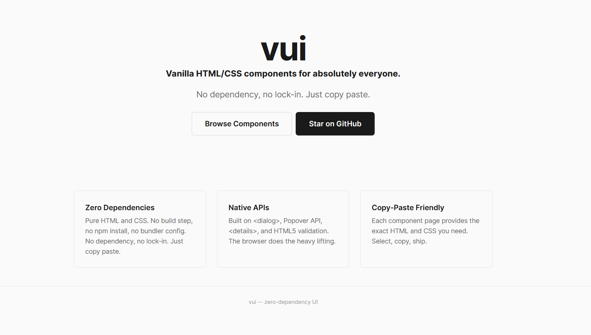

<div style="font-family: -apple-system, BlinkMacSystemFont, &quot;Segoe UI&quot;, Roboto, &quot;Helvetica Neue&quot;, Arial, sans-serif; border: 1px solid rgb(224, 224, 224); border-radius: 12px; padding: 20px; max-width: 500px; background: rgb(255, 255, 255); box-shadow: rgba(0, 0, 0, 0.05) 0px 2px 8px;"><div style="display: flex; align-items: center; gap: 12px; margin-bottom: 12px;"><div style="flex: 1 1 0%; min-width: 0px;"><h3 style="margin: 0px; font-size: 18px; font-weight: 600; color: rgb(26, 26, 26); line-height: 1.3; overflow: hidden; text-overflow: ellipsis; white-space: nowrap;">VUI Zero-dependency UI components</h3><p style="margin: 4px 0px 0px; font-size: 14px; color: rgb(102, 102, 102); line-height: 1.4; overflow: hidden; text-overflow: ellipsis; display: -webkit-box; -webkit-line-clamp: 2; -moz-box-orient: vertical;">Vanilla HTML/CSS components for absolutely everyone.</p></div></div><a href="https://www.producthunt.com/products/vui-zero-dependency-ui-components?embed=true&amp;utm_source=embed&amp;utm_medium=post_embed" target="_blank" rel="noopener" style="display: inline-flex; align-items: center; gap: 4px; margin-top: 12px; padding: 8px 16px; background: rgb(255, 97, 84); color: rgb(255, 255, 255); text-decoration: none; border-radius: 8px; font-size: 14px; font-weight: 600;">Check it out on Product Hunt →</a></div>

##

Zero-dependency, copy-paste UI component library built entirely with native HTML and CSS. <br/>
No bundler. No transpiler. No framework. Just copy the HTML and CSS into your project.

Browse Components: [vui.bar](https://vui.bar)



---

## Features

- **Zero dependencies** — no npm install, no build step, no runtime
- **Native-first** — uses `<details>`, `<dialog>`, Popover API, HTML5 validation, and other platform primitives
- **Copy-paste distribution** — each component is a self-contained `.css` file and `.html` snippet
- **Standalone** — components work without `global.css` via private custom property fallbacks
- **Accessible** — relies on native element semantics, ARIA attributes where needed, and screen-reader utilities


## Quick Start

1. (optional) Copy `css/global.css` into your project (components include fallback values)
2. Pick a component from the `docs/` folder and copy its `.component.html` and `.component.css` files

```html
<!-- Example: Accordion -->
<link rel="stylesheet" href="accordion.component.css" />

<div class="vui-accordion">
  <details class="vui-accordion-item">
    <summary>Section title</summary>
    <div class="vui-accordion-body">Content goes here.</div>
  </details>
</div>
```

## Components

| Component      | Native API                 | Directory            |
|----------------|----------------------------|----------------------|
| Accordion      | `<details>` & `<summary>`  | `docs/accordion/`    |
| Alerts         | Semantic HTML              | `docs/alert/`        |
| Breadcrumb     | `<nav>` & `<ol>`           | `docs/breadcrumb/`   |
| Button         | `<button>` element         | `docs/button/`       |
| Cards          | `<article>` element        | `docs/cards/`        |
| Checkbox       | Native checkbox            | `docs/checkbox/`     |
| Dropdown       | Popover API                | `docs/dropdown/`     |
| Form Controls  | HTML5 Validation           | `docs/form/`         |
| Input Group    | Composed field rows        | `docs/input-group/`  |
| Modal          | `<dialog>` element         | `docs/modal/`        |
| Radio Buttons  | Native radio group         | `docs/radio/`        |
| Sidebar        | `<nav>` element            | `docs/sidebar/`      |
| Spinner        | CSS animation              | `docs/spinner/`      |
| Switch         | Checkbox + CSS             | `docs/switch/`       |
| Table          | Native `<table>`           | `docs/table/`        |
| Tabs           | Radio inputs + CSS         | `docs/tabs/`         |
| Tooltip        | Popover + CSS Anchor       | `docs/tooltip/`      |

## Design Tokens

All tokens live in `css/global.css` under `:root` using the naming convention `--vui-{category}-{variant}`.

Components reference tokens through private custom properties (`--_vui-*`) with hardcoded fallbacks, so they work with or without the global stylesheet.

## Project Structure

```
css/global.css          Design tokens and minimal reset
docs/                   Documentation site with live previews
  {component}/
    index.html          Docs page
    *.component.html    Standalone HTML snippet
    *.component.css     Component styles
```

## Development

The docs site is static — open any `index.html` in a local server. The only build script generates browser compatibility data:

```bash
npm install
npm run generate:compat
```

## License

MIT
